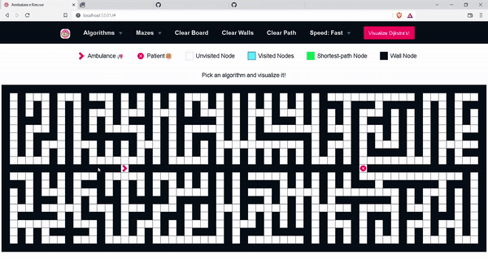
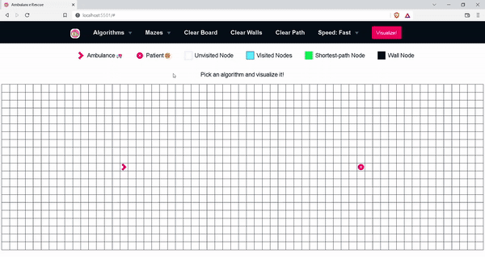

<div align="center">

<!-- 
[](https://github.com/yuvrajverma01/Algorithms-Visualizer)
[](https://github.com/yuvrajverma01/Algorithms-Visualizer/stargazers)
[](https://www.linkedin.com/in/yuvrajverma01/)
[](https://instagram.com/yuvrajverma01) -->

#   Ambulance Rescuer

</div>
You must have encountered the ambulance siren many times when you are stuck in the traffic. Although everyone prays for the safety of the patient within the ambulance. Most people do not even know the challenges of an ambulance trip. This vehicle breezes through the traffic and takes a critically ill patient to the hospital on time to bring them out of danger.
<br>
<br>
## 🚦Stuck in Traffic
Time play a crucial role in ambulance services. A person's life is dependent on your arrival. One of the most common reasons for arriving late at the patient's house is because of being stuck in traffic. Traffic is not something that is in your control, agreed. Most people give way to the ambulance, but there are times when the ambulances get stuck in the traffic.



## 🤷🏼‍♂️ About This Project

<!-- Access the site a Google Chrome: https://yuvrajverma01.github.io/Algorithms-Visualizer/# -->

### Currently supported algorithms are:

- Dijkstra's Algorithm (Weighted)
- A\* Search (Weighted)
- Greedy (Weighted)
- Breath First Search (Unweighted)
- Depth First Search (Unweighted)

### What are Pathfinding Algorithms?

Pathfinding algorithms are usually an attempt to solve the shortest path problem in graph theory. They try to find the best path given a starting point and ending point based on some predefined criteria.

### Why are they important?

Path finding algorithms are important because they are used in applications like google maps, satellite navigation systems, routing packets over the internet. The usage of pathfinding algorithms isn’t just limited to navigation systems. The overarching idea can be applied to other applications as well. The usage will become clearer as we talk about some examples and implementations of pathfinding algorithms.

### Weighted v/s Unweighted Graphs

If edges in your graph have weights then your graph is said to be a weighted graph, if the edges do not have weights, the graph is said to be unweighted. A weight is a numerical value attached to each individual edge. In a weighted graph relationships between nodes have a magnitude and this magnitude is important to the relationship we’re studying.



## ⚡ TechStack Used

This section lists all the technologies that I used to built this project.

- [Node.js](https://nodejs.org/en/)
- [Express](https://expressjs.com/)
- [JavaScript](https://www.javascript.com/)

## 🚀 Getting Started

### Prerequisites

1. Clone the repo
   ```sh
   $ git clone --single-branch -b main https://github.com/TusharDixit01/Hackercamp-22-Innovaccer.git .
   ```
2. Install NPM packages
   ```sh
   $ npm i
   ```
3. Start the server
   ```sh
   $ npm start server.js
   ```

## 📁 File Structure

The file structure of the current project is structured as shown below:

```
my-app
    ├── public
    |       ├── browser
    |       |       ├──  animations
    |       |       ├──  mazeAlgorithms
    |       |       ├──  pathfindingAlgorithms
    |       |       ├──  board.js
    |       |       ├──  bundle.js
    |       |       ├──  getDistance.js
    |       |       ├──  node.js
    |       └── styling
    ├── index.html
    └── server.js

```

## ❤ About Me

Made with ❤ by [Tushar Dixit.](https://www.linkedin.com/in/tushar-dixit-7927051b1/)
<br><br>
<a href="mailto:tushardixit028.com">

</a>
<a href="https://www.linkedin.com/in/tushar-dixit-7927051b1/">

</a>
<a href="https://www.instagram.com/_tushardixit/">

</a>
